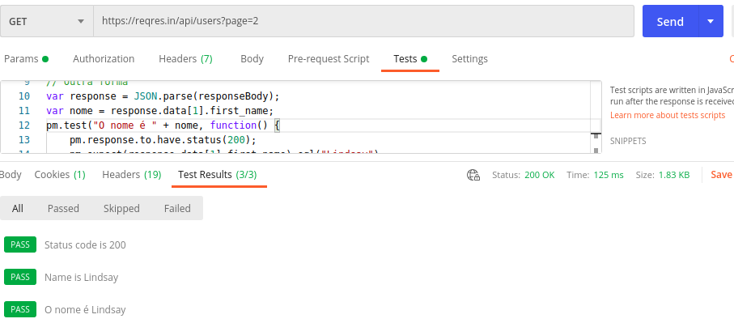
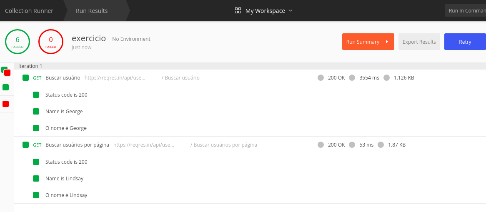

# Postman

## API

  - [Reqres](https://reqres.in/)


## Automação

  - Na aba "Tests" do Postman é possível automatizar os testes

### Exemplos: 

  - GET https://reqres.in/api/users/1

    - Validando se retornou status code 200 e se o first_name é George:

```

	pm.test("Status code is 200", () => {
	  pm.expect(pm.response.code).to.eql(200);  
	});
	pm.test("Name is George", () => {
	  pm.expect(pm.response.json().data.first_name).to.eql("George");
	});


	// Outra forma
	var response = JSON.parse(responseBody);
	var nome = response.data.first_name;
	pm.test("O nome é " + nome, function() {
		pm.response.to.have.status(200);
		pm.expect(response.data.first_name).eql("George");
	});

```

  - GET https://reqres.in/api/users?page=2

    - Validando se retornou status code 200 e se o first_name do segundo item da lista é Lindsay:

```
	pm.test("Status code is 200", () => {
	  pm.expect(pm.response.code).to.eql(200);  
	});
	pm.test("Name is Lindsay", () => {
	  pm.expect(pm.response.json().data[1].first_name).to.eql("Lindsay");
	});


	// Outra forma
	var response = JSON.parse(responseBody);
	var nome = response.data[1].first_name;
	pm.test("O nome é " + nome, function() {
		pm.response.to.have.status(200);
		pm.expect(response.data[1].first_name).eql("Lindsay");
	});

```

### Visualizando o resultado dos testes




## Runner

  - Permite rodar toda a bateria de testes 

    - Clicar em "Runner" e abaixo no botão "Run nome_collection"




## Pre-request Script

  - Execução de algum script que deve ser realizado antes de tudo


## Geração de token de Authorization a ser utilizado em outros endpoints

  - [Automação token](automacao_token.pdf)

  - [Exemplo stackoverflow](https://stackoverflow.com/questions/50907041/how-automatically-getting-token-in-postman)